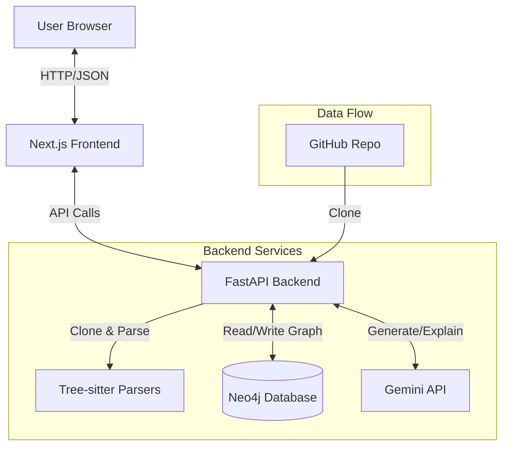

# CodeViz AI - Project Architecture

## 1. Project Overview
**CodeViz AI** is a tool designed to visualize and understand codebases by converting them into an interactive graph. It allows users to:
- **Visualize** the structure of a GitHub repository (files, classes, functions, dependencies).
- **Chat** with the codebase using AI (Gemini 2 Pro) which has context from the graph.
- **Search** and explore code elements.

## 2. Technology Stack

### Frontend
- **Framework**: [Next.js 15](https://nextjs.org/) (App Router)
- **Language**: TypeScript
- **UI Library**: React 19
- **Styling**: TailwindCSS
- **Visualization**: [@xyflow/react](https://reactflow.dev/) (formerly React Flow)
- **HTTP Client**: Built-in `fetch` / Server Actions

### Backend
- **Framework**: [FastAPI](https://fastapi.tiangolo.com/) (Python 3.12+)
- **Parser**: [Tree-sitter](https://tree-sitter.github.io/) (via `tree-sitter` Python bindings)
- **Database**: [Neo4j](https://neo4j.com/) (Graph Database) for storing code structure.
- **AI**: Google Gemini 2 Pro (via `google-generativeai` SDK).
- **Utils**: `GitPython` for cloning, `pydantic` for data validation.

## 3. System Architecture



## 4. Key Workflows

### A. Repository Analysis
1.  **Request**: User submits a GitHub URL.
2.  **Clone**: Backend clones the repo to a temporary directory (`temp_repos/`).
3.  **Discovery**: `collect_files` walks the directory, filtering by supported extensions `.py`, `.js`, `.ts`.
4.  **Parsing**:
    -   `parsers/treesitter.py` selects the appropriate grammar.
    -   Extracts: **Functions**, **Classes**, **Imports**, **Function Calls**.
5.  **Graph Construction**:
    -   `graph/neo4j_client.py` pushes data to Neo4j.
    -   Creates Nodes: `Repo`, `File`, `Function`, `Class`, `Module`.
    -   Creates Edges: `CONTAINS`, `HAS_METHOD`, `CALLS`, `IMPORTS`.

### B. Graph Visualization
1.  **Fetch**: Frontend requests `/graph/{repo_id}`.
2.  **Query**: Backend executes a Cypher query to fetch all nodes and relationships.
3.  **Layout**:
    -   `components/GraphViewer.tsx` receives raw nodes/edges.
    -   `layoutNodes` function organizes them:
        -   `Repo` at top.
        -   `Files` in a grid below.
        -   `Functions`/`Classes` grouped below their files.
    -   Color coding applied (e.g., Green for Files, Yellow for Functions).

### C. AI Chat / Explanation
1.  **Context**: When a user asks a question or requests an explanation of a node.
2.  **Retrieval**: Backend queries Neo4j for relevant code snippets (e.g., the function body, its callers, and dependencies).
3.  **Prompting**: Constructs a prompt with the code context.
4.  **Inference**: Sends to Gemini 2 Pro.
5.  **Response**: Streams answer back to user.

## 5. Data Model (Graph Schema)

### Nodes
-   **Repo**: `id`, `name`, `url`
-   **File**: `path`, `language`, `size`, `hash`
-   **Class**: `name`, `start_line`, `end_line`
-   **Function**: `name`, `params`, `return_type`, `start_line`, `end_line`
-   **Module**: `name` (for external imports)

### Relationships
-   `(:Repo)-[:HAS_FILE]->(:File)`
-   `(:File)-[:CONTAINS]->(:Class)`
-   `(:File)-[:CONTAINS]->(:Function)`
-   `(:Class)-[:HAS_METHOD]->(:Function)`
-   `(:Function)-[:CALLS]->(:Function)`
-   `(:File)-[:IMPORTS]->(:Module)`

## 6. Directory Structure

```text
codeviz/
├── backend/
│   ├── main.py              # FastAPI entry point & routes
│   ├── config.py            # Env vars & constants
│   ├── parsers/
│   │   ├── treesitter.py    # Core parsing logic
│   │   └── languages.py     # Language-specific queries
│   ├── graph/
│   │   ├── neo4j_client.py  # DB connection & write methods
│   │   └── queries.py       # Read queries (search, graph fetch)
│   └── ai/
│       └── gemini.py        # LLM integration
└── frontend/
    ├── app/                 # Next.js pages (page.tsx = Home)
    └── components/
        ├── GraphViewer.tsx  # React Flow graph
        ├── ChatPanel.tsx    # Chat interface
        └── CodePreview.tsx  # Code syntax highlighting
```
