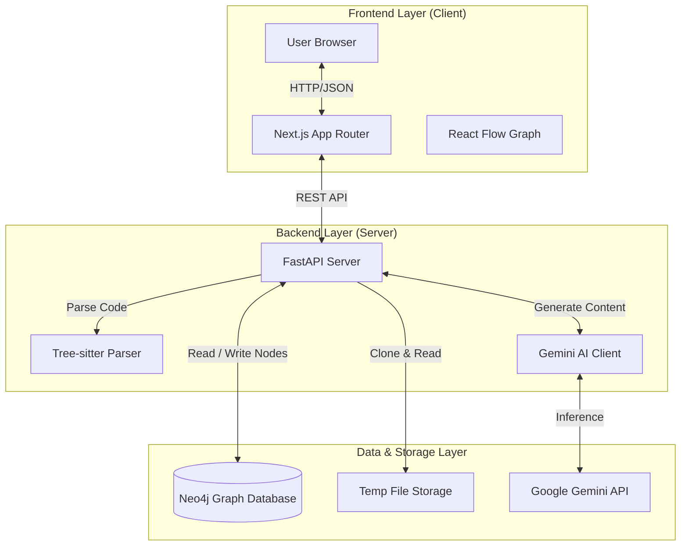
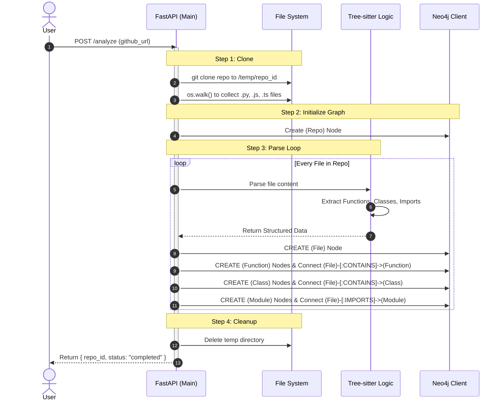
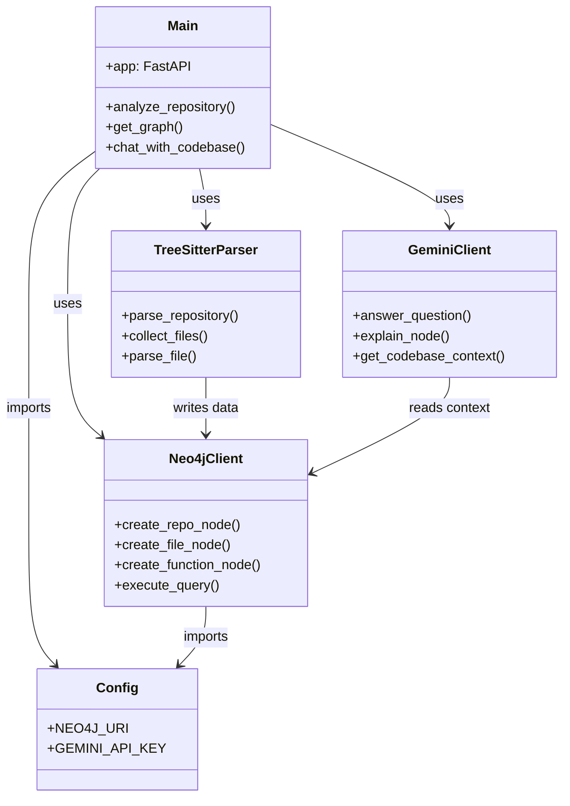
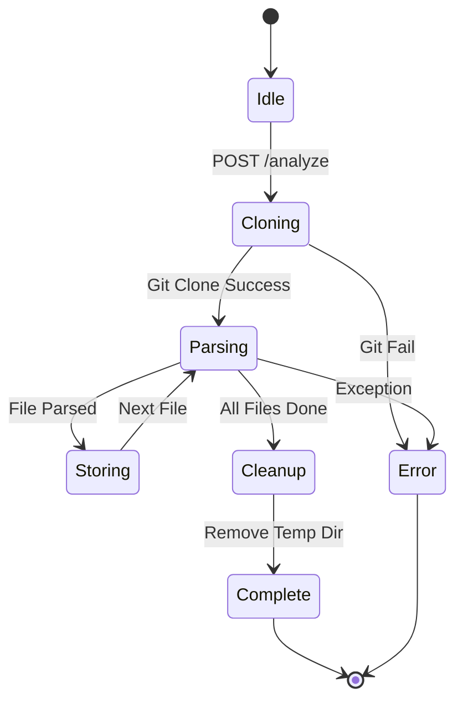

# CodeViz AI - Comprehensive Project Analysis

> [!IMPORTANT]
> This document provides a full deep-dive into the CodeViz AI project, based on current code implementation. It explains how the system analyzes code, builds graphs, and powers AI chat.

## 1. Project Overview & Architecture

**CodeViz AI** is a full-stack application designed to visualize GitHub repositories as interactive graphs and enable AI-powered conversations about the codebase.

### High-Level System Architecture



---

## 2. Core Workflows (How it Works)

### Workflow A: The Analysis Pipeline (`/analyze`)

This is the most complex part of the system. It turns raw code into structured graph data.



### Workflow B: The RAG Chat Pipeline (`/chat`)

How the AI answers questions using your codebase as context.

```mermaid
sequenceDiagram
    autonumber
    actor User
    participant API as FastAPI
    participant DB as Neo4j Database
    participant LLM as Gemini Client

    User->>API: POST /chat (question, repo_id)
    activate API
    
    Note over API, DB: Step 1: Context Retrieval
    API->>DB: MATCH (r:Repo)-[:HAS_FILE|CONTAINS]->(nodes)
    DB-->>API: Return list of Files, Functions, Classes
    
    Note over API, LLM: Step 2: Prompt Construction
    API->>API: Format Context (List of filenames/signatures)
    API->>API: Create Prompt: "Answer {question} using this context..."
    
    Step 3: AI Inference
    API->>LLM: generate_content(prompt)
    LLM-->>API: Return Text Response
    
    API-->>User: Return Response + Citations
    deactivate API
```

---

## 3. Detailed Component Analysis

### 🖥️ Frontend (`frontend/`)
Built with **Next.js 15** and **React 19**.
-   **GraphViewer.tsx**: The core visualization component.
    -   Uses `@xyflow/react` (React Flow) to render nodes.
    -   **Layout Logic**: Implements a custom grid layout.
        -   `Repo` node at the top.
        -   `File` nodes in a grid row below.
        -   `Class` and `Function` nodes below their respective files.
    -   **Interaction**: Clicking a node triggers `onNodeClick`, likely to show code details.

### ⚙️ Backend (`backend/`)
Built with **FastAPI** and **Python 3.12**.

#### 1. Parsing Engine (`parsers/treesitter.py`)
-   **Capabilities**: Supports Python, JavaScript, TypeScript.
-   **Extraction**:
    -   **Functions**: Names, parameters, return types, line numbers.
    -   **Classes**: Names, line ranges.
    -   **Imports**: Module names.
    -   **Calls**: Identifies function calls (but note: these are structurally extracted but not currently fully utilized in the graph connections).

#### 2. Graph Database Layer (`graph/neo4j_client.py`)
-   **Driver**: Uses `neo4j` async driver.
-   **Schema Implementation**:
    -   **Nodes**: `Repo`, `File`, `Function`, `Class`, `Module`.
    -   **Relationships**:
        -   `(:Repo)-[:HAS_FILE]->(:File)`
        -   `(:File)-[:CONTAINS]->(:Function)`
        -   `(:File)-[:CONTAINS]->(:Class)`
        -   `(:File)-[:IMPORTS]->(:Module)`
        -   *(Note: `CALLS` and `HAS_METHOD` relationships are defined in the client but not actively populated in the main parsing loop currently).*

#### 3. AI Intelligence (`ai/gemini.py`)
-   **Model**: Google Gemini 2.0 Flash (`gemini-2.0-flash`).
-   **Context Strategy**:
    -   Fetches a summary of the repo structure (list of files and top-level functions).
    -   Does *not* currently dump the entire source code into the context window (optimized for token usage).
    -   **Explain Feature**: Fetches the specific source code lines for a node and asks Gemini to explain just that snippet in context.

---

## 4. Logical Data Model

This diagram represents how the data is organized in the Neo4j database.

```mermaid
erDiagram
    REPOSITORY ||--|{ FILE : contains
    FILE ||--o{ CLASS : defines
    FILE ||--o{ FUNCTION : defines
    FILE ||--o{ MODULE : imports
    
    REPOSITORY {
        string id PK
        string name
        string url
    }
    
    FILE {
        string path PK
        string language
        int size
        string hash
    }
    
    CLASS {
        string name
        int start_line
        int end_line
    }
    
    FUNCTION {
        string name
        string params
        string return_type
        int start_line
        int end_line
    }
    
    MODULE {
        string name
    }
```

## 5. Summary of Capabilities

| Feature | Status | Description |
| :--- | :--- | :--- |
| **Repo Parsing** | ✅ Active | Clones and parses Python/JS/TS files efficiently using Tree-sitter. |
| **Visualization** | ✅ Active | Visualizes file structure and code definitions in a hierarchical grid. |
| **Code Search** | ✅ Active | Finds nodes by name. |
| **AI Chat** | ✅ Active | Answers questions using project structure as context. |
| **AI Explanation** | ✅ Active | "Explain this node" extracts code and explains it. |
| **Call Graph** | ⚠️ Partial | Parser identifies calls, but the graph edges (`CALLS`) are not yet fully wired in the main analysis loop. |

---

## 6. Additional Diagrams for Clarity

### A. Backend Component Diagram (Internal Structure)
This diagram shows how the Python modules in `backend/` interact with each other.



### B. Analysis State Machine
The lifecycle of a repository analysis request.



### C. Frontend Component Hierarchy
How the React components are structured in the Next.js application.

```mermaid
graph TD
    Page[Page (Home)] --> Layout[RootLayout]
    Layout --> Main[Main Content Area]
    
    Main --> SplitView[Split View Container]
    
    SplitView --> GraphArea[Graph Area]
    SplitView --> ChatArea[Chat Sidebar]
    
    GraphArea --> GraphViewer[GraphViewer.tsx]
    GraphViewer --> ReactFlow[React Flow Instance]
    GraphViewer --> MiniMap
    GraphViewer --> Controls
    
    ChatArea --> ChatPanel[ChatPanel.tsx]
    ChatPanel --> MessageList
    ChatPanel --> InputArea
    
    GraphViewer -.->|On Node Click| CodePreview[Code Preview Modal]
```


