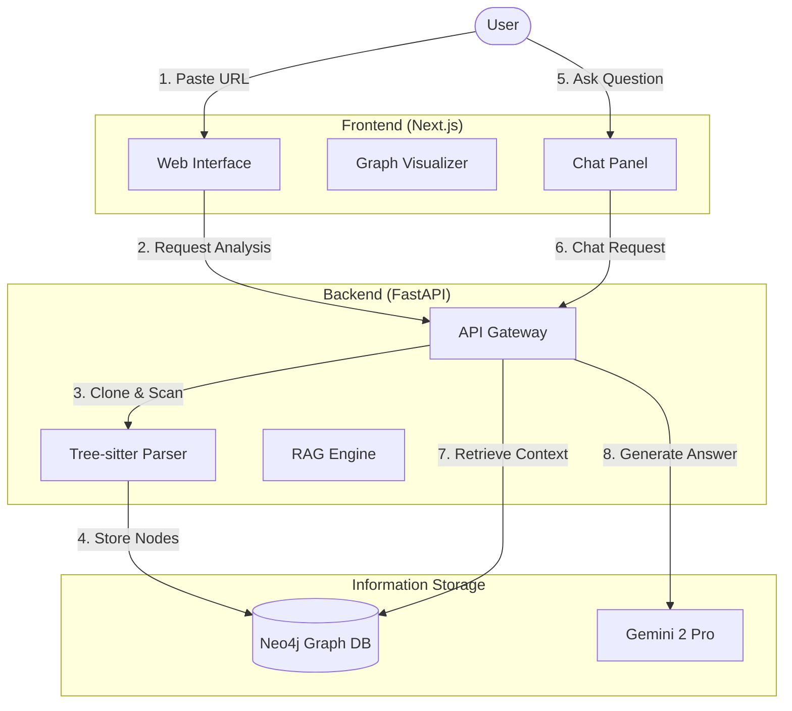
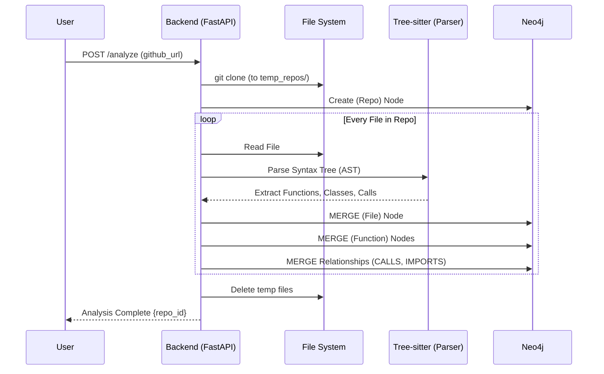
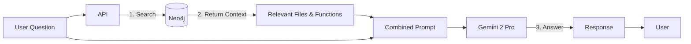
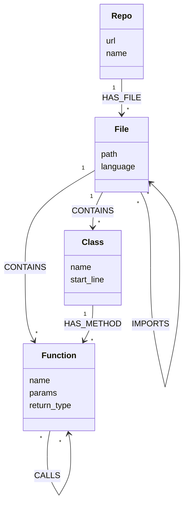

# CodeViz AI - The Complete Guide

## 1. High-Level Architecture
**CodeViz AI** is a bridge between your codebase and your understanding. It turns lines of code into a navigable map and an intelligent conversation partner.

---

## 2. Core Workflow: From Code to Graph (The "Analyze" Process)
This is what happens when you click "Analyze". It's a pipeline that transforms raw text into a structured knowledge graph.

**Explanation:**
1.  **Clone**: The server temporarily downloads the code.
2.  **Parse**: It uses `Tree-sitter`, a library that understands code syntax. It doesn't just read lines; it understands "This is a function named `process_data` taking arguments `x` and `y`".
3.  **Graphing**: It pushes these entities to Neo4j. If `Function A` calls `Function B`, a physical link is created in the database.

---

## 3. Core Workflow: RAG Chat (The "Ask" Process)
How does the AI know about *your* specific code? It uses **Retrieval Augmented Generation (RAG)**.

**Why this matters:**
Standard ChatGPT doesn't know your private code. CodeViz fixes this by looking up the *exact* functions and classes related to your question in the Graph Database and feeding them to Gemini before it answers.

---

## 4. The Data Model (Graph Schema)
This is how your code is stored in the database.

---

## 5. Technical Deep Dive (Key Components)

### Backend (`/backend`)
*   **`main.py`**: The traffic controller. It receives requests and delegates them.
*   **`parsers/treesitter.py`**: The "Translator". It converts raw text (code) into data (functions/classes).
*   **`graph/neo4j_client.py`**: The "Librarian". It knows how to organize this data into the shelf (database) so it can be found later.

### Frontend (`/frontend`)
*   **`GraphViewer.tsx`**: The "Map". uses React Flow to draw the nodes. It calculates layout so files look like a grid and functions sit inside them.
*   **`ChatPanel.tsx`**: The "Interface". It handles the conversation state and streaming responses.

