**CodeViz AI** is a tool designed to visualize and understand codebases by converting them into an interactive graph. It allows users to:
- **Visualize** the structure of a GitHub repository (files, classes, functions, dependencies).
- **Chat** with the codebase using AI (Gemini 2 Pro) which has context from the graph.
- **Search** and explore code elements.

## Features

- Analyze any GitHub repository
- Interactive graph visualization with React Flow
- AI-powered chat to ask questions about the codebase
- Search functions and classes
- Code explanations powered by Gemini 2 Pro

## Tech Stack

**Frontend:**
- Next.js 15
- React 19
- TypeScript
- TailwindCSS
- React Flow

**Backend:**
- Python 3.12+
- FastAPI
- Tree-sitter (code parsing)
- Neo4j (graph database)
- Gemini 2 Pro API

## Project Structure

```
codeviz/
├── frontend/           # Next.js application
│   ├── app/           # Pages and layouts
│   ├── components/    # React components
│   └── lib/           # API client and utilities
├── backend/           # FastAPI server
│   ├── parsers/       # Tree-sitter code parsing
│   ├── graph/         # Neo4j client and queries
│   ├── ai/            # Gemini integration
│   └── models/        # Pydantic schemas
└── .env.example       # Environment variables template
```

## Setup

### Prerequisites

- Python 3.12+
- Node.js 18+
- Neo4j Aura account (free tier)
- Gemini API key

### Backend Setup

```bash
cd backend
python -m venv venv
source venv/bin/activate  # Windows: venv\Scripts\activate
pip install -r requirements.txt

# Copy .env.example to .env and fill in your credentials
cp ../.env.example .env

# Run the server
uvicorn main:app --reload
```

### Frontend Setup

```bash
cd frontend
npm install
npm run dev
```

### Environment Variables

Create a `.env` file in the backend directory:

```env
NEO4J_URI=neo4j+s://xxxxx.databases.neo4j.io
NEO4J_USER=neo4j
NEO4J_PASSWORD=your_password
GEMINI_API_KEY=your_gemini_api_key
```

## API Endpoints

| Endpoint | Method | Description |
|----------|--------|-------------|
| `/health` | GET | Health check |
| `/analyze` | POST | Analyze a GitHub repository |
| `/graph/{repo_id}` | GET | Get graph data for visualization |
| `/chat` | POST | Chat with AI about the codebase |
| `/explain` | GET | Get AI explanation for a code element |
| `/search` | GET | Search functions and classes |

## Usage

1. Open the app at `http://localhost:3000`
2. Paste a GitHub repository URL
3. Wait for analysis to complete
4. Explore the interactive graph
5. Click nodes to see code explanations
6. Use the chat to ask questions

## Supported Languages

- Python
- JavaScript
- TypeScript

## License

MIT

---

# Advanced Architecture Maps

This section contains **technical diagrams** for CodeViz AI, ranging from the high-level system view to low-level internal logic.

## 1. The "Big Picture" (System Architecture)
This shows how the pieces fit together.

```mermaid
graph TD
    %% Styling - Black and White
    classDef default fill:#ffffff,stroke:#000000,stroke-width:2px,color:#000000;

    User(["👤 User"])
    
    subgraph "Frontend (Vercel)"
        UI["💻 Next.js Website"]
    end
    
    subgraph "Backend (Render)"
        API["🐍 FastAPI Server"]
        Parser["⚙️ Tree-Sitter Engine"]
    end
    
    subgraph "Cloud Services"
        Neo4j["🗄️ Neo4j Graph DB"]
        Gemini["🧠 Gemini 1.5 Pro"]
        GitHub["☁️ GitHub"]
    end

    User -->|1. Pastes Repo URL| UI
    UI -->|2. Sends Request| API
    API -->|3. Clones Code| GitHub
    API -->|4. Parses Code| Parser
    Parser -->|5. Saves Graph| Neo4j
    
    User -->|6. Asks Question| UI
    UI -->|7. Chats| API
    API -->|8. Retrieves Context| Neo4j
    API -->|9. Generates Answer| Gemini
```



## 2. The "Analysis" Pipeline (High Level)
What happens when you click **"Analyze"**?


## 3. The Tree-Sitter Parsing Logic (AST Extraction)
How we turn raw text into a structured graph.


## 4. The RAG "Fusion" Pipeline
How we construct the prompts for Gemini using Graph Data.


## 5. The Neo4j Graph Schema (Entity-Relationship)
The exact structure of the database nodes and edges.


=======
>>>>>>> 8ef95f5457e03e5a4957d4d5cf3c609e2b2facc5
