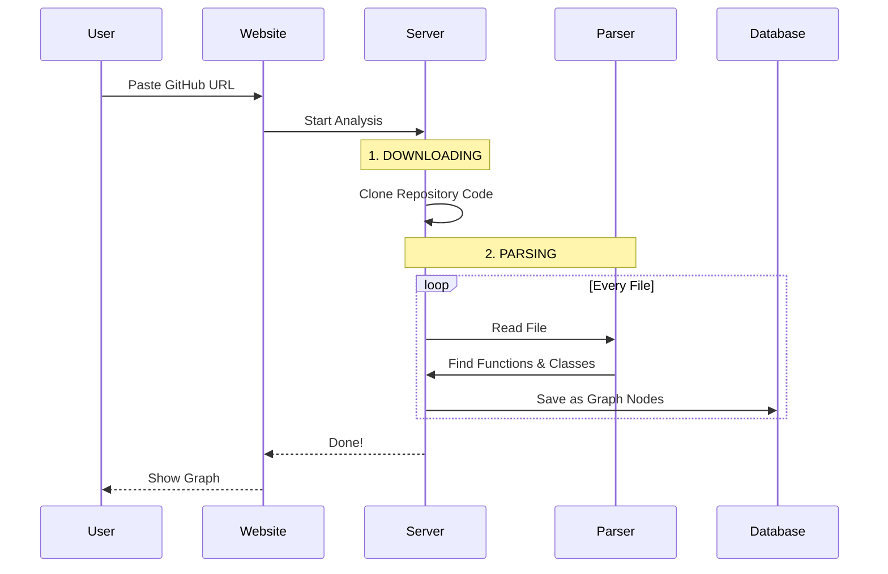
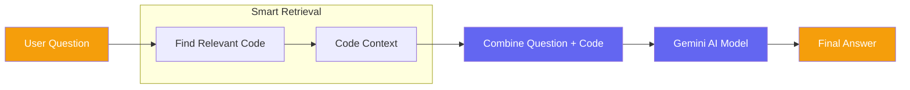

# 🗺️ CodeViz Visual Project Map

> **HOW TO VIEW THIS FILE:**
> 1. Look at the top right of your editor window.
> 2. Click the icon that looks like an open book with a magnifying glass (or press `Ctrl+K V`).
> 3. You will see these diagrams rendered as pictures.

---

## 1. THE BIG PICTURE (Architecture)
This diagram shows all the main pieces of the project and how they connect.

```mermaid
graph TD
    %% Styling for better visibility
    classDef frontend fill:#3b82f6,color:white,stroke:#1d4ed8
    classDef backend fill:#10b981,color:white,stroke:#047857
    classDef data fill:#ef4444,color:white,stroke:#b91c1c
    classDef ai fill:#8b5cf6,color:white,stroke:#6d28d9

    User((USER)) -- Opens Website --> Frontend[FRONTEND (Next.js)]:::frontend
    
    Frontend -- Sends Requests --> Backend[BACKEND (FastAPI)]:::backend
    
    subgraph "Backend System"
        Backend -- Downloads Code --> LocalStorage[Temp Files]:::backend
        Backend -- Reads Code --> Parser[Tree-sitter Parser]:::backend
    end
    
    subgraph "External Services"
        Backend -- Saves Graph Data --> Database[(Neo4j Graph DB)]:::data
        Backend -- Asks Questions --> AI[Google Gemini AI]:::ai
    end
```

---

## 2. HOW ANALYSIS WORKS (Step-by-Step)
What happens when you click the "Analyze" button.



---

## 3. HOW CHAT WORKS (The Brain)
How the AI answers your questions about the code.


