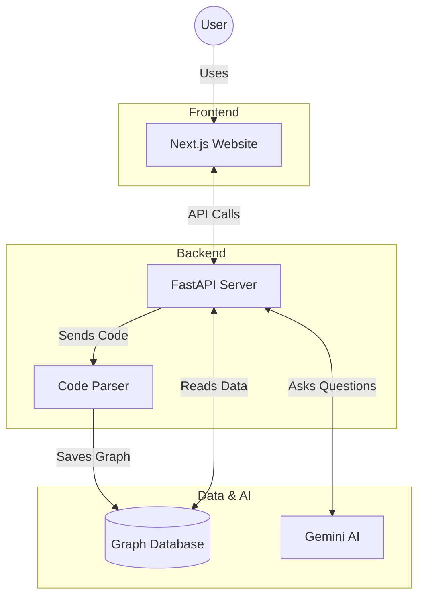
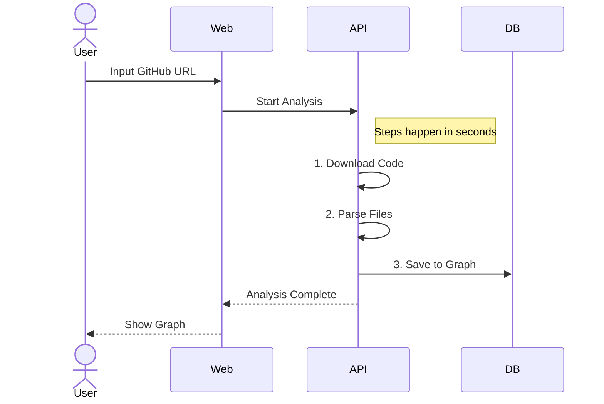
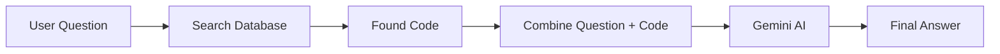

# CodeViz AI - Project Diagrams

## 1. System Architecture



## 2. Analysis Workflow



## 3. Chat Workflow



## 4. Data Structure

```mermaid
erDiagram
    REPO ||--|{ FILE : contains
    FILE ||--o{ FUNCTION : defines
    FILE ||--o{ CLASS : defines
    CLASS ||--o{ FUNCTION : has_method
    
    REPO { string name }
    FILE { string path }
    FUNCTION { string name }
    CLASS { string name }
```
